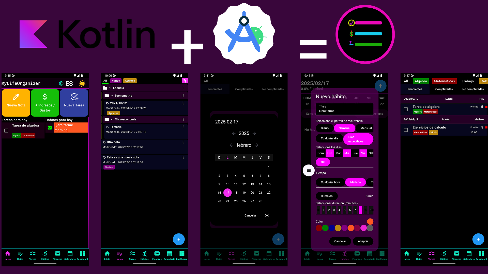

# 📱 My Life Organizer - Tu asistente personal integral



[](https://kotlinlang.org/)
[](https://developer.android.com/jetpack/compose)
[](https://developer.android.com/training/data-storage/room)

**My Life Organizer** es una aplicación todo-en-uno para organizar tu vida diaria, con un enfoque en privacidad y personalización, desarrollada completamente con Kotlin y Jetpack Compose.

## ✨ Características Principales

### 📝 Notas con Markdown Personalizado
- Editor de texto con **parser Markdown propio** y estilo visual único
- Soporte para formato avanzado (encabezados, listas, código, etc.)
- Búsqueda instantánea en todas tus notas

### ✅ Gestión de Tareas y Hábitos
- Sistema de tareas con recordatorios y categorías
- Seguimiento de hábitos con estadísticas visuales
- Streaks y logros para mantener la motivación

### 💰 Gestión Financiera
- Registro de ingresos y gastos diarios
- Visualización por categorías con gráficos interactivos
- Exportación de datos a CSV

### 🔒 Todo local y privado
- **100% offline** - Tus datos pertenecen solo a ti
- Almacenamiento seguro con **Room SQLite**
- Copias de seguridad manuales/automáticas

## 🛠 Tecnologías Utilizadas

- **Lenguaje**: Kotlin 100% nativo
- **UI Moderna**: Jetpack Compose con Material 3
- **Persistencia**: Room Database con SQLite
- **Arquitectura**: MVVM con Clean Architecture
- **Otras librerías**: 
  - Kotlin Coroutines para operaciones asíncronas
  - Flow para estados reactivos

## 📲 Instalación

1. Descarga el APK desde [Releases](https://github.com/jesusds603/my_life_organizer/releases)
2. Alternativamente, clona y compila el proyecto:

```bash
git clone https://github.com/tu-usuario/my-life-organizer.git
cd my-life-organizer
